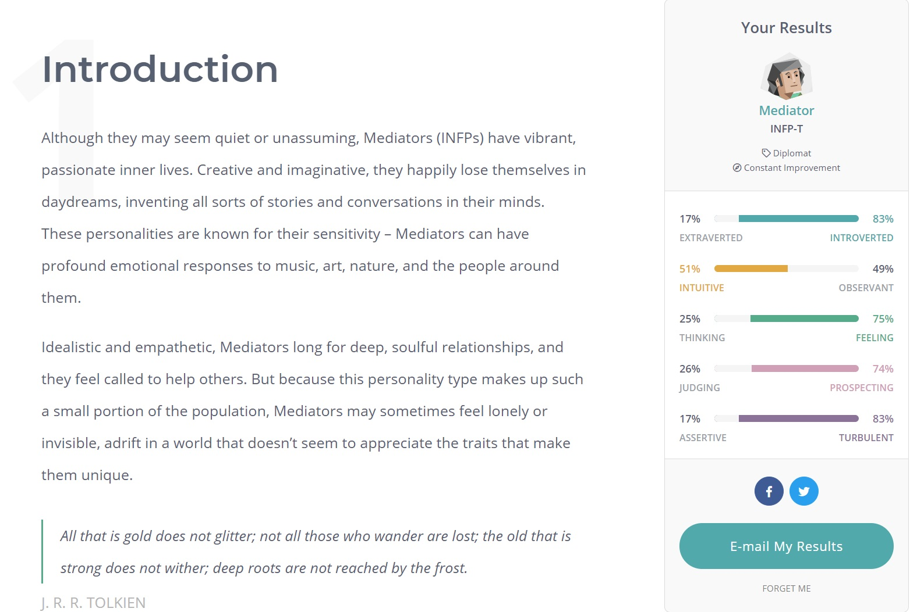

<DOCTYPE html>
<html>
<head>
<title>Assignment 1</title>
</head>
<body style="background-color:lightgrey;">
<h2>Personal Information</h2>

<h3>Name:</h3>
Sean Delaney
<h3>Student Number:</h3>
3917732
<h3>Student Email address:</h3>
s3917732@student.rmit.edu.au
<h3>Background Info:</h3>
I'm an Australian born student. Ever since finishing school I've studied various topics relating to digital media at several other universities and TAFE to no avail. Like most other students I imagine studying IT and programming, I am also a avid video game player but also spend some of my off time playing tennis which I have played for around 8 years still

<h2> Interest in IT </h2>
<h3>My interest in IT:</h3>

My interest in IT studies has always been one that I have been passionate about since I was of a younger age. I always spent a lot of time around computers and vide games growing up, and still spend a lot of my free time playing games, fiddling with hardware and writing code for programs. I have studied ICT during high school and have looked at several game creation platforms such as unreal and blender to make models.

<h3>Why I chose RMIT:</h3>

I spent a long time looking around at different universities, reviews and what sites such as open universities had to say about what RMIT was like. through research I found many important things. The most import to me in particular though was the fact of how many IT and programming graduates are able to find suitable work when finishing as the RMIT IT courses are very well known.

<h3>What do I expect to learn:</h3>

I hope to learn the ability, not just in this subject, but in my entire years of studies to be able to learn how to fully develop most types of code from website and game development. Also learning the inner workings of IT departments and development. Before I started studying I was just happy to work in a simple IT department or a IT store but now that I have started studying and I have friends who are studying the same thing, I hope to one day be able to develop something with them

<h2> Ideal Job </h2>

<a href="https://www.seek.com.au/job/52330332?type=standard#searchRequestToken=58a63c16-5c79-4067-a6df-2665505689c7" target="_blank">Ideal Software Development Job</a>

<h3>The Position:</h3>

This position is for a Software engineer which main role is the development and maintenance of the C# network server and Microsoft SQL database. Any IT development studio interest me just as long as I am able to get into the industry to get experience.

<h3>Skills required:</h3>
<ul>
  <li>Bachelor in appropriate studies</li>
  <li>5 Years of experience</li>
  <li>Knowledge of coding programs such as C and C++</li>
  <li>Database management experience</li>
  <li>Ability to work in teams</li>
</ul>

And of course the interest in this field of work. so much so that you have an interest in gaming(preferably appropriate to this position)

<h3>Skills currently have:</h3>
<ul>
  <li>Currently Working on the Degree</li>
  <li>Very little knowledge of C and C++</li>
  <li>Very little experience in SQL databases</li>
  <li>Have a massive interest in gaming (All labeled and more)</li>
</ul>
<h3>How will I obtain required skills:</h3>

Hopefully throughout my entire course of IT, I will be able to develop the skills required to at least delve deeper into what each type of coding programs are needed. Spending personal free time experimenting with C and C++ is also going to be beneficial to this position as to get some experience. Also taking any position I can when graduating to get eh required experience will also be beneficial.

<h2> Personal Profile </h2>
<h3>Myers-Briggs Test Results:</h3>

<h3>Online Learning Style Test:</h3>

<h3>Creativity Test:</h3>

<h3>What do these Results Mean:</h3>

In a very short Summary, these results mean that I tend to be a very introverted but respectful person who tends to learn by visual learning means. I have always known that I tend to learn better by visual means, whether it be by someone directly showing me how to accomplish something of but pictured diagrams showing me step by step instructions on a procedure. The main downside of this however is that I am very quick to get distracted.

<h3>How do I think these Influence my team behavior:</h3>

If anything, these results will hamper my ability to work in a team. Since I am very introverted and tend to want to work alone, I am very quick to help make a plan, assign roles so that I can get back to working on my own, believing that all other people in the group are working on their appropriate sections.

<h3>How should I take this into account when forming teams:</h3>

Having someone who would rather work by themselves would be hard to implement into a team environment but I do believe it is possible. I have had to work on many team tasks in the past and there are many people are willing to help introverted people such as myself without being demeaning. Having people of various strengths and weaknesses is essential to creating a cohesive group as there are able to help each other. Having introverted, extroverted, creative, factual, leaders, followers etc... people is important to create a balanced group environment.

</body>
</html>
