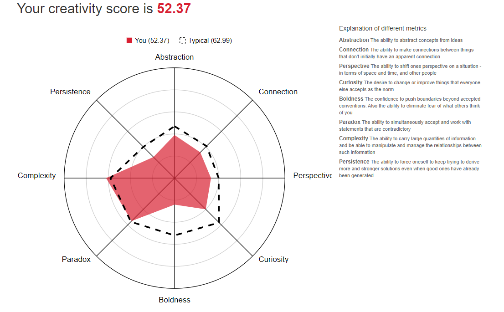

<DOCTYPE html>
<html>
<head>
<title>Assignment 1</title>
<style>

body {
  margin: 0;
  font-family: "Lato", sans-serif;
}

.sidebar {
  margin: 0;
  padding: 0;
  width: 200px;
  background-color: #f1f1f1;
  position: fixed;
  height: 100%;
  overflow: auto;
}

.sidebar a {
  display: block;
  color: black;
  padding: 16px;
  text-decoration: none;
}

.sidebar a.active {
  background-color: #04AA6D;
  color: white;
}

.sidebar a:hover:not(.active) {
  background-color: #555;
  color: white;
}

div.content {
  margin-left: 200px;
  padding: 1px 16px;
  height: 1000px;
}
</stlye>
</head>

<body>

  <a class="active" href=""#home">Home</a>
  <a href="#Interest In IT">Interest in IT</a>
  <a href="#Ideal Job">Ideal Job</a>
  <a href="#Personal Profile">Personal Profile</a>
  <a href="#Project Idea">Project Idea</a>

  <h2>Personal Information</h2>
  
  <h3>Name:</h3>
  Sean Delaney
  <h3>Student Number:</h3>
  3917732
  <h3>Student Email address:</h3>
  s3917732@student.rmit.edu.au
  <h3>Background Info:</h3>
  I'm an Australian born student. Ever since finishing school I've studied various topics relating to digital media at several other universities and TAFE to no avail. Like most other students I imagine studying IT and programming, I am also a avid video game player but also spend some of my off time playing tennis which I have played for around 8 years still

  <h2> Interest in IT </h2>
  <h3>My interest in IT:</h3>
  
My interest in IT studies has always been one that I have been passionate about since I was of a younger age. I always spent a lot of time around computers and vide games growing up, and still spend a lot of my free time playing games, fiddling with hardware and writing code for programs. I have studied ICT during high school and have looked at several game creation platforms such as unreal and blender to make models.

  <h3>Why I chose RMIT:</h3>
  
I spent a long time looking around at different universities, reviews and what sites such as open universities had to say about what RMIT was like. through research I found many important things. The most import to me in particular though was the fact of how many IT and programming graduates are able to find suitable work when finishing as the RMIT IT courses are very well known.

  <h3>What do I expect to learn:</h3>
  
I hope to learn the ability, not just in this subject, but in my entire years of studies to be able to learn how to fully develop most types of code from website and game development. Also learning the inner workings of IT departments and development. Before I started studying I was just happy to work in a simple IT department or a IT store but now that I have started studying and I have friends who are studying the same thing, I hope to one day be able to develop something with them

  <h2> Ideal Job </h2>
  
<a href="https://www.seek.com.au/job/52330332?type=standard#searchRequestToken=58a63c16-5c79-4067-a6df-2665505689c7" target="_blank">Ideal Software Development Job</a>

  

  <h3>The Position:</h3>
  
This position is for a Software engineer which main role is the development and maintenance of the C# network server and Microsoft SQL database. Any IT development studio interest me just as long as I am able to get into the industry to get experience.

  <h3>Skills required:</h3>
  <ul>
    <li>Bachelor in appropriate studies</li>
    <li>5 Years of experience</li>
    <li>Knowledge of coding programs such as C and C++</li>
    <li>Database management experience</li>
    <li>Ability to work in teams</li>
  </ul>
  
And of course the interest in this field of work. so much so that you have an interest in gaming(preferably appropriate to this position)

  <h3>Skills currently have:</h3>
  <ul>
    <li>Currently Working on the Degree</li>
    <li>Very little knowledge of C and C++</li>
    <li>Very little experience in SQL databases</li>
    <li>Have a massive interest in gaming (All labeled and more)</li>
  </ul>
  <h3>How will I obtain required skills:</h3>
  
Hopefully throughout my entire course of IT, I will be able to develop the skills required to at least delve deeper into what each type of coding programs are needed. Spending personal free time experimenting with C and C++ is also going to be beneficial to this position as to get some experience. Also taking any position I can when graduating to get eh required experience will also be beneficial.

  <h2> Personal Profile </h2>
  <h3>Myers-Briggs Test Results:</h3>
  

  
  

  <h3>Online Learning Style Test:</h3>
  

  
  

  <h3>Creativity Test:</h3>
  

  

  <h3>What do these Results Mean:</h3>
  
In a very short Summary, these results mean that I tend to be a very introverted but respectful person who tends to learn by visual learning means. I have always known that I tend to learn better by visual means, whether it be by someone directly showing me how to accomplish something of but pictured diagrams showing me step by step instructions on a procedure. The main downside of this however is that I am very quick to get distracted.

  <h3>How do I think these Influence my team behavior:</h3>
  
If anything, these results will hamper my ability to work in a team. Since I am very introverted and tend to want to work alone, I am very quick to help make a plan, assign roles so that I can get back to working on my own, believing that all other people in the group are working on their appropriate sections.

  <h3>How should I take this into account when forming teams:</h3>
  
Having someone who would rather work by themselves would be hard to implement into a team environment but I do believe it is possible. I have had to work on many team tasks in the past and there are many people are willing to help introverted people such as myself without being demeaning. Having people of various strengths and weaknesses is essential to creating a cohesive group as there are able to help each other. Having introverted, extroverted, creative, factual, leaders, followers etc... people is important to create a balanced group environment.

  <h2>Project Idea</h2>
  <h3>Overview:</h3>
  
I would like to experiment/make a short game demo using the unreal engine 4. This task would be more to get experience using the unreal engine and to potentially take my knowledge into the newer version of unreal 5 when it is released. The unreal engine is widely used in many gaming applications so knowledge in this field is invaluable when it comes to finding position in gaming companies. The short demo I would like to create would take small snippets of inspiration from various other games in an attempt to create a whole original game in the future. Hopefully I would also like to get the opinions and help from various friends who are also studying the same course and develop a larger game with them

  <h3>Motivation:</h3>
  
My motivation stems from my love of video games and the interest in moving the field forward. most people who play video games always imagine small and large ways that they might want to change a game to make it better but are never able to actually implement it. Through studying this course, I will actually be able to get the knowledge and skills to be able to make a well fleshed out game. This will be the first step to many implementations in the future that I will hopefully work and continue to implement into the future.

  <h3>Project Description:</h3>
  
During this small time I have to implement a working product later on in the subject I hope to create at least a small area that you are able to walk around with. In there area there will be a few models of my creation, whether they just be simple chairs of blocks on the ground to fill in the area. I'm not sure how far I will get with it but I would like to hopefully implement or experiment with a few other things such as particle animations, weapon firing (just objects coming out of character), jumping/climbing objects or a UI.

  

  
I have worked with implementing First person perspectives before in programs such a Python and using model creation platforms. Following Guides, using the unreal engine own guides or other online platforms, I should hopefully be able to implement a working first person system. the trickiest thing I have found while doing first person before has always been how stable the camera is with keyboard and mouse controls, but this could have stemmed from various problems in the python code I was using

  

  
For the creation of Objects, I will most likely experiment using Unreal's own model creator to save me the problem of implementing and exporting object from other model creation software I have used before such as Blender. I will create a few large boxes if I plan to implement the jumping system so that the objects can actually be used instead of just being there

  

  
Particle animation would range from anything from dust, to smoke, steam, explosions, magic etc....I may just have a few objects mist/dust be the particles I use for this experiment as a way to add more feel to the environment

  

  
Whether it be wonky or not, the starting implementation of a jumping system will be useful as it is used in so many games and is of course going to be needed in a later iteration of the project. Whether it be something as simple as altering a Z-axis of the camera on a button press will be a great start to a jumping mechanic

  

  
In my opinion, a great UI is extremely important in a game. much like most other aspects of a game, a UI can greatly deter someone from wanting to paly something is the user interface is user friendly. hopefully I can at least implement something simple, maybe having something to do with the weapon firing mechanic or some other system. This may be one of the first thing I work on as this will be extremely important to me to make this a fluid and appealing as possible

  

  
Weapon firing would like weird without your character actually holding a weapon in their hands. Because of this it would be easier this early in development to at least just have an object firing out of your character to show what there animation would look like at a later date

  

  
Obviously I may not be able to implement all of these things by the required time of the 3rd assignment, but these are things to continue working on until I have completed something cohesive.

  <h3>Tools and Techniques:</h3>
  <h4>Blender:</h4>
  Blender in my opinion is one of the easiest to use and most well known model creation platform online at this time. It is also easy to export from and the import files and models into the Unreal engine to be able to be used there
  <h4>Unreal Engine:</h4>
  The unreal Engine is the basis for this project as this is where most of project is created. this enables us to use C++ source code and Model designed to make and immersive 2D or 3D game or projects.
  <h4>(In the Future)Nakama:</h4>
  Nakama is used as a server for social and Realtime games and applications. Nakama is used as the basis of user identification when logging into a server and can be used to store data related to a players account
  <h3>Skills required:</h3>
  Most importantly when it comes to the Unreal Engine is the ability to understand C++ source code and the ability to adequately model object using its implemented model creator. however, like most coding and creation platforms, there are a plethora of visual and written guides to assist in the making of anything you could want. alternatively, I could use blender, which I do currently have some knowledge in, having used it before for other projects and import models into unreal from there
  <h3>Outcome:</h3>
  At the end of this small demo project, I hope to at least have some sort of cohesive start to an environment and a gaming feel. this project will also hopefully allow me to start learning the skills that i will need to make a much larger game in the future, but currently, it may hopefully allow me to gain the some of the skills I may need to pass my later subjects during this course. In total, this project is to mainly to allow me to gain skills and knowledge that will help me for years and years in the future

</body>
</html>
